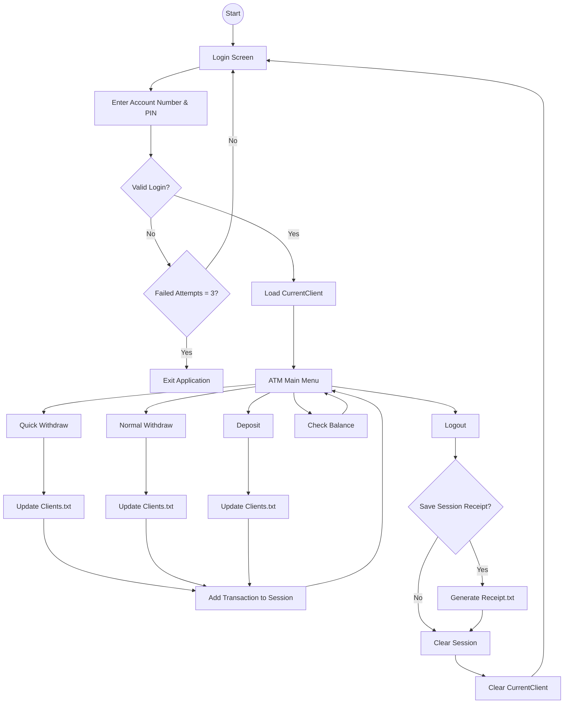
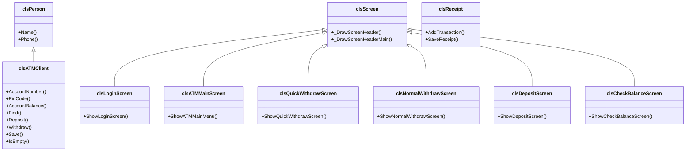
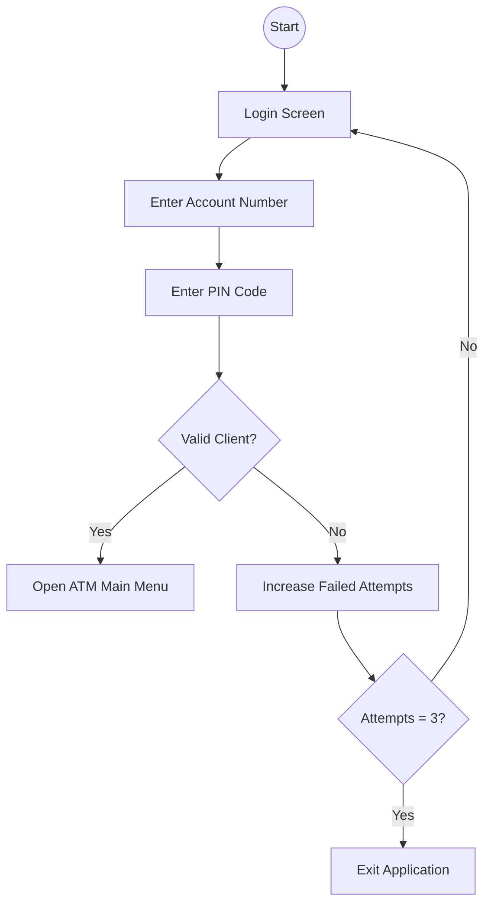
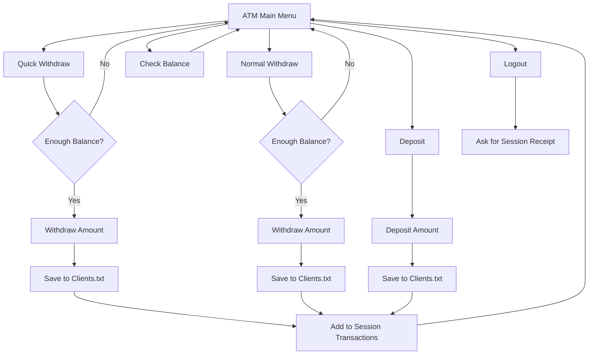
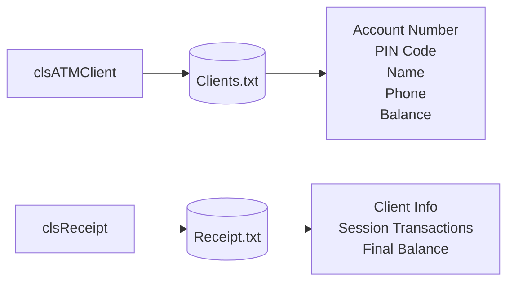

# **E-ATMSystem v2.0**

**E-ATMSystem** is a console-based ATM simulation system developed in **C++** using **Object-Oriented Programming (OOP)** principles.

The project simulates the core functionalities of a real Automated Teller Machine (ATM), including secure authentication, deposits, withdrawals, balance inquiries, session receipts, and persistent data storage using text files.

The application was refactored from a procedural implementation into a modular OOP architecture to improve maintainability, readability, and scalability.

---

# **Table of Contents**

1. Features
2. Login Information
3. Database Structure
4. How It Works
5. Project Structure
6. System Architecture
7. System Diagrams
8. Learning Goals
9. Changes from Previous Version
10. Author

---

# **Features**

## **Authentication**

* Secure login using Account Number and PIN Code
* Maximum of **3 login attempts**
* Automatic session logout
* Return to Login Screen after Logout

---

## **ATM Operations**

* Quick Withdraw
* Normal Withdraw
* Deposit
* Check Balance
* Logout

---

## **Session Receipt**

* Records all successful transactions during the current session
* Generates a receipt when logging out
* Receipt is saved as **Receipt.txt**
* Previous receipt is automatically replaced

---

## **Persistent Storage**

* Clients are stored inside `Clients.txt`
* Account balances are updated immediately
* Data is preserved between executions

---

## **Command-Line Interface (CLI)**

* Login Screen
* ATM Main Menu
* Quick Withdraw Screen
* Normal Withdraw Screen
* Deposit Screen
* Check Balance Screen

---

# **Login Information**

Example account:

| Account Number | PIN Code |
| -------------- | -------- |
| AD100          | 1234     |

> Client accounts can be modified directly inside **Clients.txt**.

---

# **Database Structure**

## **Clients.txt**

Stores all client information.

| Field           |
| --------------- |
| Account Number  |
| PIN Code        |
| Client Name     |
| Phone           |
| Account Balance |

---

Each record uses the custom separator:

```text
#//#
```

Example:

```text
AD100#//#1234#//#Youness Chergui Amin#//#0600000000#//#3500
```

---

# **How It Works**

1. Client enters Account Number and PIN Code.
2. Credentials are validated.
3. ATM Main Menu is displayed.
4. Client performs one or more banking operations.
5. Every successful transaction is recorded in the current session.
6. Client logs out.
7. The system asks whether to generate a receipt.
8. Receipt is saved to **Receipt.txt**.

---

# **System Architecture**



---

# **System Diagrams**

## **UML Class Diagram**



## **Login Flow**



## **ATM Operations Flow**



## **File Storage Diagram**



---

# **Learning Goals**

This project was created to practice:

* Object-Oriented Programming (OOP)
* Classes & Objects
* Encapsulation
* Inheritance
* Modular Design
* File Handling
* Data Persistence
* ATM Simulation
* Authentication Systems
* Session Management
* Receipt Generation

---

# **Changes from Previous Version**

| Feature             | v1.0                   | v2.0                              |
| ------------------- | ---------------------- | --------------------------------- |
| Programming Style   | Procedural Programming | Object-Oriented Programming (OOP) |
| Authentication      | Basic                  | Improved                          |
| Login Attempts      | Unlimited              | Maximum 3 Attempts                |
| Quick Withdraw      | Available              | Refactored                        |
| Normal Withdraw     | Available              | Refactored                        |
| Deposit             | Available              | Refactored                        |
| Check Balance       | Available              | Refactored                        |
| Session Receipt     | Not Available          | Added                             |
| Receipt.txt         | Not Available          | Added                             |
| Screen Architecture | Not Available          | Added                             |
| Code Organization   | Single File            | Multi-file OOP                    |
| Documentation       | Basic                  | Professional                      |

---

# **Author**

**Youness Chergui Amin**

**ATM Simulation System – C++ / Object-Oriented Programming**
