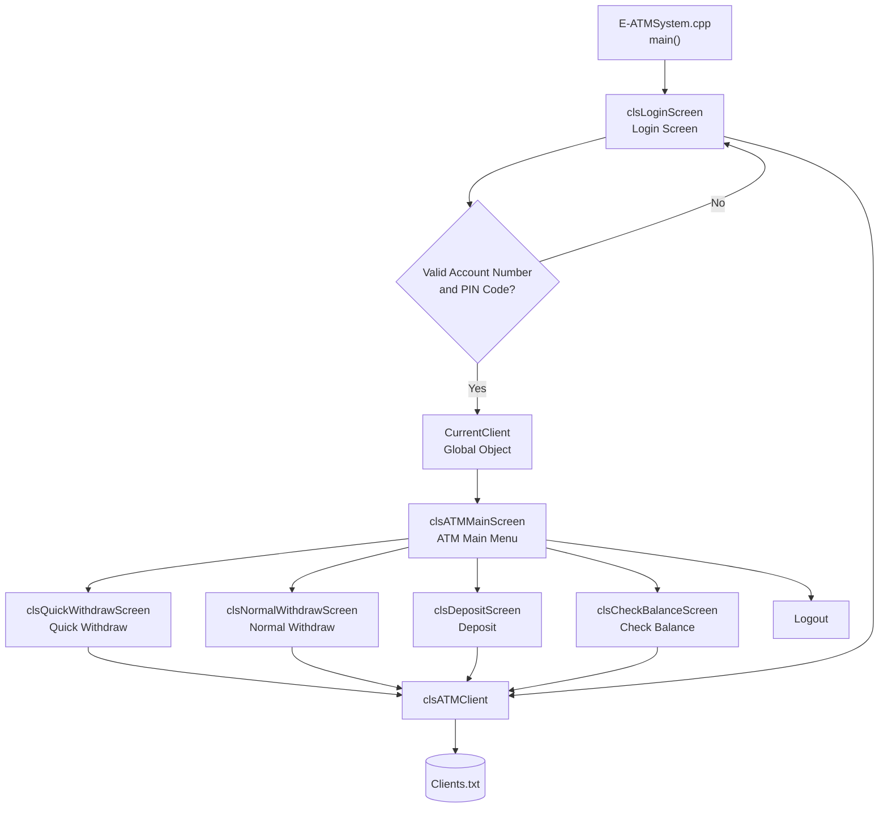
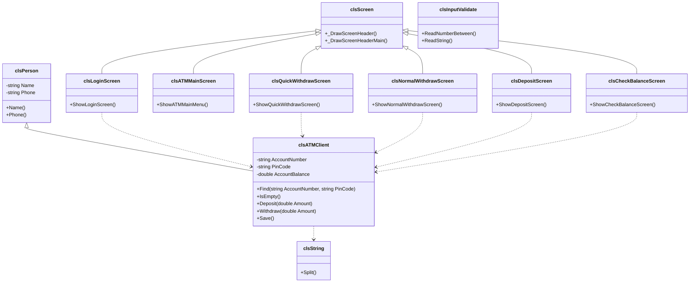
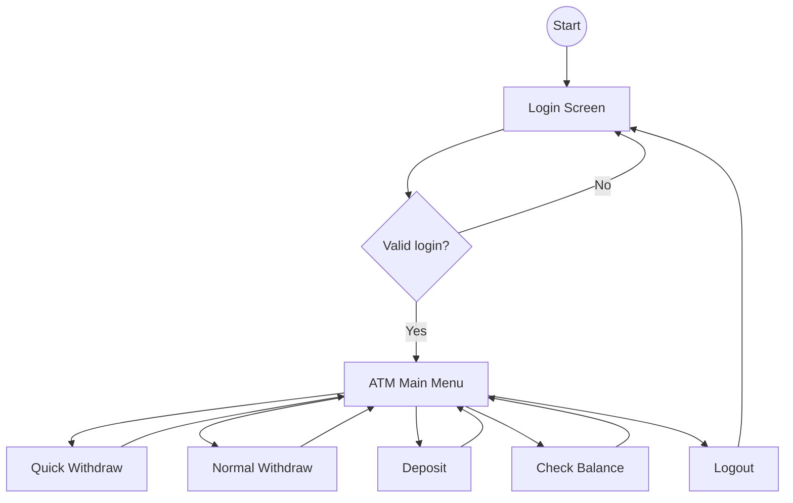
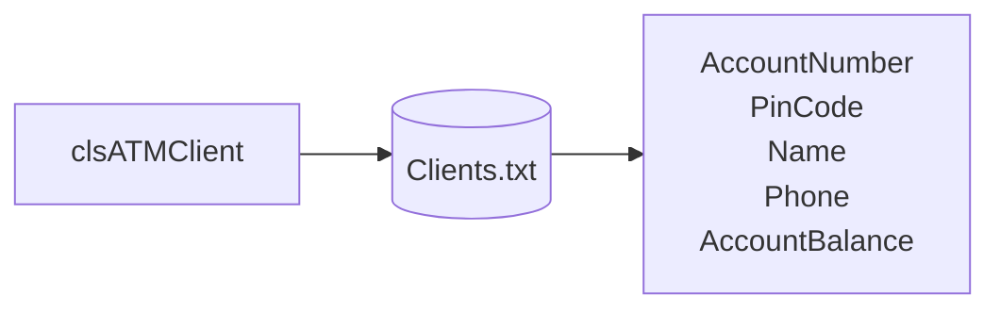

# **E-ATMSystem v2.0**

**E-ATMSystem** is a console-based ATM simulation system developed in **C++**.
The project allows clients to securely access their accounts, perform withdrawals, deposit money, and check balances through a simple command-line interface.

The first version was developed using a procedural programming approach.
In **v2.0**, the project was refactored into an **Object-Oriented Programming (OOP)** architecture, making the code cleaner, more organized, and easier to maintain.

---

# **Table of Contents**

1. Features
2. Login Information
3. Database Structure
4. How It Works
5. Project Structure
6. System Architecture
7. System Diagrams
8. Learning Goals
9. Changes from Previous Version
10. License

---

# **Features**

## **User Authentication**

* Login using Account Number and PIN Code
* Validate user credentials from `Clients.txt`
* Return to login screen after logout

---

## **ATM Transactions**

* Quick Withdraw with predefined amounts
* Normal Withdraw with custom amount
* Deposit money
* Check current balance
* Validate withdrawal amount before processing
* Save account balance after each transaction

---

## **Quick Withdraw Options**

* 20
* 50
* 100
* 200
* 400
* 600
* 800
* 1000

---

## **Command-Line Interface (CLI)**

* Login Screen
* ATM Main Menu
* Quick Withdraw Screen
* Normal Withdraw Screen
* Deposit Screen
* Check Balance Screen

---

## **Persistent Storage**

* Client data is stored in `Clients.txt`
* Account balances are updated immediately after each transaction
* Records use a custom separator: `#//#`

---

# **Login Information**

Example login credentials:

| Account Number | PIN Code |
| -------------- | -------- |
| AD100          | 1234     |

> You can change or add clients directly inside `Clients.txt`.

---

# **Database Structure**

## **Clients.txt**

Stores client account information.

| Field           |
| --------------- |
| Account Number  |
| PIN Code        |
| Client Name     |
| Phone           |
| Account Balance |

---

Each record is stored using this format:

```text
AccountNumber#//#PinCode#//#Name#//#Phone#//#AccountBalance
```

Example:

```text
AD100#//#1234#//#Youness Chergui Amin#//#0600000000#//#34215
```

---

# **How It Works**

1. The client enters an Account Number and PIN Code.
2. The system searches for the account inside `Clients.txt`.
3. If the login information is correct, the ATM Main Menu is displayed.
4. The client chooses an operation:

   * Quick Withdraw
   * Normal Withdraw
   * Deposit
   * Check Balance
   * Logout
5. The transaction is validated.
6. The account balance is updated.
7. Changes are saved back to `Clients.txt`.

---

# **Project Structure**

```text
E-ATMSystem.cpp

├── Core Classes
│   ├── Person.h
│   └── ATMClient.h
│
├── Screens
│   ├── LoginScreen.h
│   ├── ATMMainScreen.h
│   ├── QuickWithdrawScreen.h
│   ├── NormalWithdrawScreen.h
│   ├── DepositScreen.h
│   └── CheckBalanceScreen.h
│
├── Utilities
│   ├── StringLib.h
│   └── InputValidate.h
│
├── Global
│   └── Global.h
│
├── Data Files
│   └── Clients.txt
│
└── README.md
```

---

# **System Architecture**

```text
Login System
      │
      ▼
 ATM Main Menu
 ├── Quick Withdraw
 ├── Normal Withdraw
 ├── Deposit
 ├── Check Balance
 └── Logout
```

---

# **System Diagrams**

## **Complete System Architecture**



## **UML Class Diagram**



## **Navigation Flow**



## **File Storage Diagram**



---

# **Learning Goals**

This project was created to practice and improve:

* Object-Oriented Programming (OOP)
* Classes and Objects
* Encapsulation
* Inheritance
* File Handling using `fstream`
* Data persistence using text files
* Authentication using Account Number and PIN Code
* Transaction validation
* Modular screen-based architecture
* Clean code organization

---

# **Changes from Previous Version**

| Feature               | v1.0                   | v2.0                              |
| --------------------- | ---------------------- | --------------------------------- |
| Programming Style     | Procedural Programming | Object-Oriented Programming (OOP) |
| Authentication        | Available              | Refactored using Classes          |
| Quick Withdraw        | Available              | Refactored into Screen Class      |
| Normal Withdraw       | Available              | Refactored into Screen Class      |
| Deposit               | Available              | Refactored into Screen Class      |
| Check Balance         | Available              | Refactored into Screen Class      |
| Persistent Storage    | Available              | Improved using `clsATMClient`     |
| Global Current Client | Struct-based           | Object-based                      |
| Code Organization     | Single Source File     | Multi-file Architecture           |
| Inheritance           | Not Available          | Added                             |
| Encapsulation         | Limited                | Improved                          |
| Modular Screens       | Not Available          | Added                             |
| Documentation         | Basic                  | Professional                      |

---

# **License**

Open-source. Free to use and modify.
